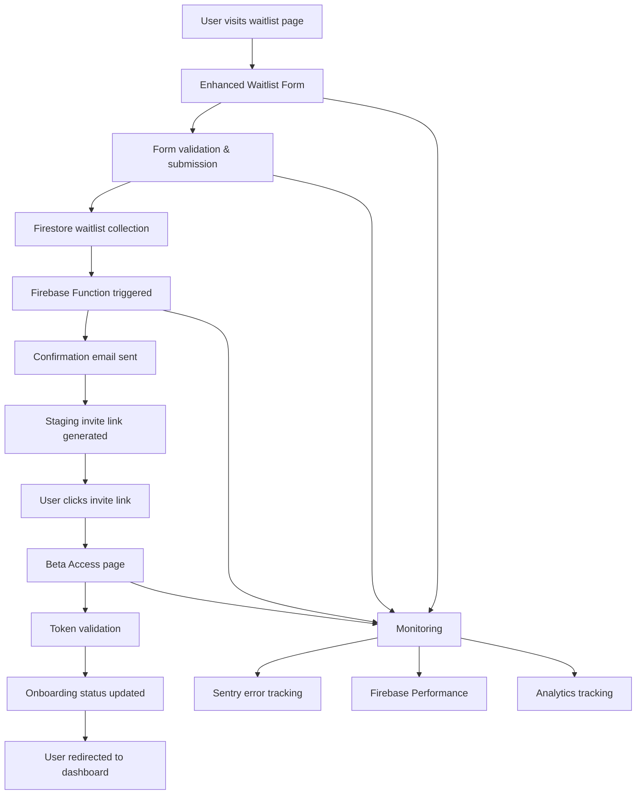

# Coach Core AI - Beta Onboarding Flow Documentation

## Overview
This document outlines the complete beta onboarding flow for Coach Core AI, including the enhanced waitlist form, Firestore schema updates, email confirmation system, and staging deployment integration.

## Architecture Overview



## Components

### 1. Enhanced Waitlist Form
**File**: `src/components/Waitlist/EnhancedWaitlistForm.tsx`

#### Features:
- **Multi-step form** with progressive disclosure
- **Role selection**: Head Coach, Assistant Coach, Coordinator, etc.
- **Team level selection**: Youth, High School, College, etc.
- **Source tracking**: Beta launch, website, social media, etc.
- **Duplicate prevention**: Email validation and checking
- **Analytics integration**: User action tracking
- **Error handling**: Comprehensive error states and recovery

#### Form Fields:
```typescript
interface WaitlistEntry {
  email: string;           // Required, validated
  name: string;           // Required, 1-100 chars
  role: string;           // Required, from predefined list
  teamLevel: string;      // Required, from predefined list
  source: string;         // Auto-set to 'beta-launch'
  onboardingStatus: 'invited' | 'onboarded' | 'pending';
  createdAt: Date;        // Server timestamp
  invitedAt?: Date;       // When invite was sent
  onboardedAt?: Date;     // When user completed onboarding
  inviteToken?: string;   // Unique token for beta access
  ipAddress?: string;     // For analytics
  userAgent?: string;     // For analytics
  utmSource?: string;     // UTM tracking
  utmMedium?: string;     // UTM tracking
  utmCampaign?: string;   // UTM tracking
}
```

#### Role Options:
- `head-coach`: Head Coach
- `assistant-coach`: Assistant Coach
- `coordinator`: Coordinator
- `position-coach`: Position Coach
- `volunteer`: Volunteer Coach
- `athletic-director`: Athletic Director
- `other`: Other

#### Team Level Options:
- `youth`: Youth (Ages 8-13)
- `high-school`: High School
- `college`: College
- `semi-pro`: Semi-Pro
- `professional`: Professional
- `other`: Other

### 2. Firestore Schema Updates
**File**: `firestore.rules` (updated)

#### Enhanced Waitlist Collection Rules:
```javascript
match /waitlist/{id} {
  // No read access for security
  allow get, list: if false;

  // Public create-only with enhanced schema
  allow create: if
    hasOnlyKeys([
      'email', 'name', 'role', 'teamLevel', 'source', 'onboardingStatus',
      'createdAt', 'invitedAt', 'onboardedAt', 'inviteToken',
      'ipAddress', 'userAgent', 'utmSource', 'utmMedium', 'utmCampaign'
    ]) &&
    hasRequiredKeys(['email', 'name', 'role', 'teamLevel', 'source', 'onboardingStatus', 'createdAt']) &&
    // ... validation rules for each field

  // Allow updates only for onboarding status changes
  allow update: if
    // ... update rules for status changes only
}
```

#### Security Features:
- **Email validation**: Proper email format and length
- **Role validation**: Only predefined roles allowed
- **Team level validation**: Only predefined levels allowed
- **Source validation**: Only predefined sources allowed
- **Immutable fields**: Core data cannot be changed after creation
- **Server timestamps**: All timestamps enforced server-side

### 3. Email Confirmation System
**Files**: 
- `functions/src/waitlist-email.ts`
- `functions/src/lib/email-service.ts`

#### Firebase Function:
```typescript
export const sendWaitlistConfirmationEmail = onDocumentCreated(
  'waitlist/{waitlistId}',
  async (event) => {
    // Triggered when new waitlist entry is created
    // Sends confirmation email with staging invite link
    // Updates onboarding status to 'invited'
  }
);
```

#### Email Service:
- **SendGrid integration** (primary)
- **Firebase Functions fallback** (development)
- **HTML and text email templates**
- **Dynamic content based on user role/level**
- **Staging invite link generation**

#### Email Templates:
- **Beta welcome email** with immediate access
- **General waitlist email** with launch updates
- **Responsive HTML design**
- **Plain text fallback**
- **Unsubscribe and privacy links**

### 4. Beta Access Page
**File**: `src/pages/BetaAccess.tsx`

#### Features:
- **Token validation** against Firestore
- **User information display**
- **Feature showcase** with status indicators
- **Getting started guide**
- **Onboarding status tracking**
- **Error handling** for invalid/expired tokens

#### Token Validation:
```typescript
// Query waitlist for the token
const q = query(
  collection(db, 'waitlist'),
  where('inviteToken', '==', token)
);
```

#### Onboarding Flow:
1. User clicks invite link
2. Token is validated against Firestore
3. User information is displayed
4. User clicks "Access Beta Dashboard"
5. Onboarding status updated to 'onboarded'
6. User redirected to main dashboard

### 5. Monitoring Integration
**Files**: 
- `src/services/monitoring/index.ts`
- `src/services/analytics/index.ts`

#### Sentry Integration:
- **Error tracking** for all waitlist operations
- **User context** with role and team level
- **Performance monitoring** for form submissions
- **Custom breadcrumbs** for user actions

#### Firebase Performance:
- **Custom traces** for waitlist signup
- **User action tracking** for form interactions
- **Performance metrics** for email delivery
- **Conversion tracking** for beta access

#### Analytics Events:
```typescript
// Waitlist signup tracking
trackWaitlistSignup({
  email: string,
  role: string,
  teamLevel: string,
  source: string,
});

// Beta access tracking
trackUserAction('beta_access', {
  email: string,
  role: string,
  teamLevel: string,
  source: string,
});

// Conversion tracking
trackWaitlistConversion({
  email: string,
  source: string,
  converted: boolean,
});
```

## Deployment Configuration

### 1. Staging Deployment
**Files**: 
- `vercel.json`
- `firebase.json`
- `deploy-staging.sh`

#### Vercel Configuration:
```json
{
  "version": 2,
  "name": "coach-core-ai-staging",
  "env": {
    "NODE_ENV": "staging",
    "REACT_APP_ENV": "staging",
    "REACT_APP_SENTRY_DSN": "@sentry_dsn_staging",
    // ... other environment variables
  }
}
```

#### Firebase Hosting:
```json
{
  "hosting": {
    "public": "dist",
    "rewrites": [
      {
        "source": "**",
        "destination": "/index.html"
      }
    ]
  }
}
```

### 2. Environment Variables
**Required for staging deployment:**

```bash
# Firebase Configuration
REACT_APP_FIREBASE_API_KEY=your_api_key
REACT_APP_FIREBASE_AUTH_DOMAIN=your_domain
REACT_APP_FIREBASE_PROJECT_ID=your_project_id
REACT_APP_FIREBASE_STORAGE_BUCKET=your_bucket
REACT_APP_FIREBASE_MESSAGING_SENDER_ID=your_sender_id
REACT_APP_FIREBASE_APP_ID=your_app_id

# Monitoring
REACT_APP_SENTRY_DSN=your_sentry_dsn
REACT_APP_ENABLE_ANALYTICS=true

# Email Service
SENDGRID_API_KEY=your_sendgrid_key
STAGING_URL=https://coach-core-ai-staging.vercel.app
```

## User Flow

### 1. Waitlist Signup
1. User visits waitlist page
2. Fills out multi-step form:
   - Step 1: Email and name
   - Step 2: Role and team level
   - Step 3: Review and confirm
3. Form validates and submits to Firestore
4. Success message displayed with invite link

### 2. Email Confirmation
1. Firebase Function triggered on new waitlist entry
2. Confirmation email sent with staging invite link
3. Email includes:
   - Personalized welcome message
   - Beta access link
   - Feature overview
   - Getting started instructions

### 3. Beta Access
1. User clicks invite link in email
2. Beta access page loads with token validation
3. User information displayed
4. Feature showcase shown
5. User clicks "Access Beta Dashboard"
6. Onboarding status updated
7. User redirected to main dashboard

## Testing

### 1. Unit Tests
**File**: `src/components/__tests__/EnhancedWaitlistForm.test.tsx`

```typescript
describe('EnhancedWaitlistForm', () => {
  test('validates required fields', () => {
    // Test form validation
  });
  
  test('prevents duplicate emails', () => {
    // Test duplicate prevention
  });
  
  test('submits with correct data', () => {
    // Test form submission
  });
});
```

### 2. Integration Tests
- **Firestore integration** testing
- **Email service** testing
- **Token validation** testing
- **Analytics tracking** testing

### 3. End-to-End Tests
- **Complete signup flow** testing
- **Email delivery** testing
- **Beta access** testing
- **Onboarding completion** testing

## Monitoring & Analytics

### 1. Key Metrics
- **Waitlist signups** per day/week
- **Email delivery rates** and bounce rates
- **Beta access conversion** rates
- **Onboarding completion** rates
- **User engagement** by role/level

### 2. Error Tracking
- **Form submission errors**
- **Email delivery failures**
- **Token validation errors**
- **Database connection issues**

### 3. Performance Monitoring
- **Form load times**
- **Email delivery latency**
- **Database query performance**
- **User action response times**

## Security Considerations

### 1. Data Protection
- **Email addresses** are hashed for analytics
- **Personal information** is encrypted in transit
- **Invite tokens** are cryptographically secure
- **Rate limiting** prevents abuse

### 2. Access Control
- **Firestore rules** prevent unauthorized access
- **Token validation** ensures legitimate access
- **Onboarding status** tracks user progression
- **Admin functions** require proper authentication

### 3. Privacy Compliance
- **GDPR compliance** for EU users
- **CCPA compliance** for California users
- **Data retention** policies implemented
- **User consent** for data processing

## Troubleshooting

### 1. Common Issues
- **Invalid email format**: Check validation regex
- **Duplicate email**: Check Firestore query
- **Email not sent**: Check SendGrid configuration
- **Token validation failed**: Check Firestore rules
- **Onboarding stuck**: Check status update logic

### 2. Debug Tools
- **Firebase Console** for Firestore data
- **SendGrid Dashboard** for email delivery
- **Sentry Dashboard** for error tracking
- **Vercel Dashboard** for deployment logs

### 3. Recovery Procedures
- **Manual email resend** via admin panel
- **Token regeneration** for expired invites
- **Data cleanup** for test entries
- **Status reset** for stuck onboarding

## Future Enhancements

### 1. Planned Features
- **A/B testing** for form variants
- **Advanced analytics** dashboard
- **Automated follow-up** emails
- **Social sharing** integration
- **Referral tracking** system

### 2. Scalability Improvements
- **Queue system** for high volume
- **Caching layer** for performance
- **CDN integration** for global delivery
- **Database optimization** for queries

### 3. User Experience
- **Mobile optimization** improvements
- **Accessibility** enhancements
- **Internationalization** support
- **Progressive web app** features

---

**Document Version**: 1.0  
**Last Updated**: December 2024  
**Next Review**: January 2025  
**Maintained By**: Development Team


