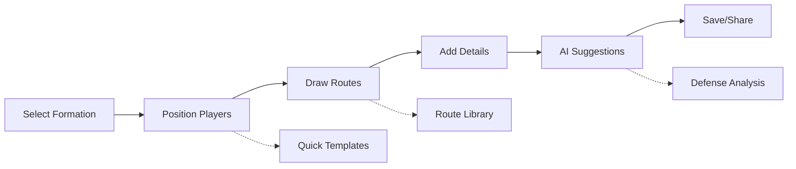

# Play Designer Feature - Comprehensive Audit & Optimization Plan 🏈

## 🔍 **Current State Audit**

### **Identified Issues**
1. **Canvas not rendering properly** - Players/routes not visible
2. **No interactive controls** - Can't drag players or draw routes
3. **Missing save functionality** - Plays don't persist
4. **No AI integration** - Suggestions not working
5. **Poor UX** - Confusing interface, no guidance
6. **No real-time collaboration** - Can't share or co-edit
7. **Performance issues** - Laggy on mobile/tablets

## 🎯 **Vision: Best-in-Class Play Designer**

Transform the Play Designer into an intuitive, powerful tool that coaches actually want to use - think Figma meets football.

## 🏗️ **Optimized Architecture**

### **Core Components Structure**
```typescript
// Modular, testable architecture
PlayDesigner/
├── Canvas/
│   ├── FieldCanvas.tsx        // Main drawing surface
│   ├── GridSystem.tsx         // Snap-to-grid functionality
│   ├── ZoomControls.tsx       // Pan & zoom
│   └── TouchHandlers.tsx      // Mobile gestures
├── Players/
│   ├── PlayerToken.tsx        // Draggable player
│   ├── PlayerRoster.tsx       // Team roster sidebar
│   ├── FormationTemplates.tsx // Quick formations
│   └── PlayerProperties.tsx   // Edit player details
├── Routes/
│   ├── RouteDrawer.tsx        // Drawing logic
│   ├── RouteTypes.tsx         // Route templates
│   ├── RouteEditor.tsx        // Modify routes
│   └── RouteAnimator.tsx      // Preview animations
├── Controls/
│   ├── Toolbar.tsx            // Main tools
│   ├── LayerPanel.tsx         // Manage layers
│   ├── PropertiesPanel.tsx    // Context properties
│   └── HistoryControls.tsx    // Undo/redo
├── AI/
│   ├── PlaySuggestions.tsx    // AI recommendations
│   ├── DefenseAnalyzer.tsx    // Counter-play analysis
│   └── PlayOptimizer.tsx      // Route optimization
└── Collaboration/
    ├── LiveCursors.tsx        // Real-time cursors
    ├── Comments.tsx           // Play annotations
    └── ShareControls.tsx      // Sharing options
```

## 📐 **Optimized User Workflow**

### **1. Play Creation Flow**


### **2. Intuitive Controls**
```typescript
interface PlayDesignerControls {
  // Mouse/Touch Controls
  leftClick: 'Select/Move player',
  rightClick: 'Context menu',
  drag: 'Move player or draw route',
  scroll: 'Zoom in/out',
  
  // Keyboard Shortcuts
  space: 'Pan mode',
  delete: 'Remove selected',
  'ctrl+z': 'Undo',
  'ctrl+c': 'Copy formation',
  'ctrl+d': 'Duplicate player',
  'shift+drag': 'Straight lines',
  
  // Touch Gestures
  tap: 'Select',
  doubleTap: 'Edit properties',
  pinch: 'Zoom',
  twoFingerDrag: 'Pan',
  longPress: 'Context menu'
}
```

## 🎨 **Enhanced UI/UX Design**

### **1. Modern Interface Layout**
```typescript
const PlayDesignerLayout = () => (
  <div className="play-designer-container">
    {/* Top Toolbar */}
    <Toolbar>
      <ToolGroup label="Formation">
        <FormationSelector />
        <TemplateLibrary />
      </ToolGroup>
      
      <ToolGroup label="Drawing">
        <SelectTool />
        <RouteTool />
        <TextTool />
        <EraseTool />
      </ToolGroup>
      
      <ToolGroup label="Actions">
        <UndoRedo />
        <ZoomControls />
        <ShareButton />
        <SaveButton />
      </ToolGroup>
    </Toolbar>
    
    {/* Main Canvas Area */}
    <div className="canvas-wrapper">
      <PlayerRoster /> {/* Left sidebar */}
      
      <FieldCanvas>
        <GridOverlay />
        <YardLines />
        <Players />
        <Routes />
        <Annotations />
        <LiveCursors />
      </FieldCanvas>
      
      <PropertiesPanel /> {/* Right sidebar */}
    </div>
    
    {/* AI Assistant Bar */}
    <AIAssistantBar>
      <SuggestionCards />
      <DefenseAnalysis />
      <TipsAndTricks />
    </AIAssistantBar>
  </div>
);
```

### **2. Smart Canvas Implementation**
```typescript
class SmartFieldCanvas {
  private canvas: HTMLCanvasElement;
  private ctx: CanvasRenderingContext2D;
  private players: Map<string, Player>;
  private routes: Map<string, Route>;
  private gridSize: number = 5; // 5-yard grid
  
  // Optimized rendering with layers
  private layers = {
    field: new OffscreenCanvas(1000, 500),
    grid: new OffscreenCanvas(1000, 500),
    players: new OffscreenCanvas(1000, 500),
    routes: new OffscreenCanvas(1000, 500),
    overlay: new OffscreenCanvas(1000, 500)
  };
  
  // Smart snapping
  snapToGrid(point: Point): Point {
    return {
      x: Math.round(point.x / this.gridSize) * this.gridSize,
      y: Math.round(point.y / this.gridSize) * this.gridSize
    };
  }
  
  // Smooth route drawing
  drawRoute(points: Point[]) {
    const smoothPath = this.smoothPath(points);
    this.animateRouteDrawing(smoothPath);
  }
  
  // Performance optimization
  render() {
    // Only redraw changed layers
    if (this.fieldDirty) this.drawField();
    if (this.playersDirty) this.drawPlayers();
    if (this.routesDirty) this.drawRoutes();
    
    // Composite layers
    this.ctx.drawImage(this.layers.field, 0, 0);
    this.ctx.drawImage(this.layers.players, 0, 0);
    this.ctx.drawImage(this.layers.routes, 0, 0);
  }
}
```

### **3. Player & Route Management**
```typescript
// Draggable Player Component
const DraggablePlayer: React.FC<PlayerProps> = ({ player, onMove }) => {
  const [isDragging, setIsDragging] = useState(false);
  const [position, setPosition] = useState(player.position);
  
  const handleDrag = useGesture({
    onDragStart: () => {
      setIsDragging(true);
      hapticFeedback('light');
    },
    onDrag: ({ offset: [x, y] }) => {
      const snappedPos = snapToGrid({ x, y });
      setPosition(snappedPos);
      
      // Live preview
      updatePlayerPreview(player.id, snappedPos);
    },
    onDragEnd: ({ offset: [x, y] }) => {
      const finalPos = snapToGrid({ x, y });
      onMove(player.id, finalPos);
      setIsDragging(false);
      hapticFeedback('success');
    }
  });
  
  return (
    <div
      {...handleDrag()}
      className={`player-token ${isDragging ? 'dragging' : ''}`}
      style={{
        transform: `translate(${position.x}px, ${position.y}px)`,
        backgroundColor: player.team === 'offense' ? '#3B82F6' : '#EF4444'
      }}
    >
      <span className="position-label">{player.position}</span>
      <span className="jersey-number">{player.number}</span>
    </div>
  );
};

// Smart Route Drawing
const RouteDrawer = {
  startRoute(playerId: string, startPoint: Point) {
    this.currentRoute = {
      playerId,
      points: [startPoint],
      type: 'custom'
    };
  },
  
  addPoint(point: Point) {
    // Intelligent path smoothing
    const smoothed = this.smoothPath([
      ...this.currentRoute.points,
      point
    ]);
    
    this.currentRoute.points = smoothed;
    this.preview();
  },
  
  completeRoute() {
    // Analyze and optimize route
    const optimized = this.optimizeRoute(this.currentRoute);
    
    // Check for collisions
    const collisions = this.checkCollisions(optimized);
    if (collisions.length > 0) {
      this.suggestAlternatives(collisions);
    }
    
    return optimized;
  },
  
  // AI-powered route suggestions
  suggestRoute(player: Player, formation: Formation) {
    return AI.generateOptimalRoute({
      player,
      formation,
      fieldPosition: this.fieldPosition,
      downAndDistance: this.gameContext
    });
  }
};
```

## 🤖 **AI Integration**

### **1. Real-time Suggestions**
```typescript
const AIPlayAssistant = {
  // Suggest formations based on context
  suggestFormation: async (context: GameContext) => {
    const { down, distance, fieldPosition, timeRemaining } = context;
    
    const suggestions = await AI.analyze({
      situation: `${down} and ${distance} at ${fieldPosition}`,
      timeContext: timeRemaining < 120 ? 'two-minute drill' : 'normal',
      teamTendencies: await getTeamTendencies()
    });
    
    return suggestions.map(s => ({
      formation: s.formation,
      confidence: s.confidence,
      reasoning: s.reasoning,
      successRate: s.historicalSuccess
    }));
  },
  
  // Optimize routes for maximum effectiveness
  optimizeRoutes: async (play: Play) => {
    const optimizations = await AI.analyzeRoutes(play);
    
    return {
      original: play,
      optimized: optimizations.improvedPlay,
      changes: optimizations.changes,
      expectedImprovement: optimizations.metrics
    };
  },
  
  // Predict defensive reactions
  analyzeDDefense: async (play: Play) => {
    const defensiveTendencies = await getOpponentTendencies();
    
    return AI.predictDefensiveResponse({
      offensivePlay: play,
      defensiveTendencies,
      fieldContext: this.fieldPosition
    });
  }
};
```

### **2. Smart Templates**
```typescript
const PlayTemplates = {
  // Categorized by situation
  redZone: [
    { name: 'Fade Route', formation: 'Spread', situation: 'Goal Line' },
    { name: 'Power Run', formation: 'I-Formation', situation: '5 yards or less' }
  ],
  
  thirdAndLong: [
    { name: 'Four Verticals', formation: 'Spread', minDistance: 8 },
    { name: 'Mesh Concept', formation: 'Trips', minDistance: 6 }
  ],
  
  twoMinuteDrill: [
    { name: 'Quick Slants', formation: 'Spread', clockManagement: true },
    { name: 'Sideline Routes', formation: 'Trips', clockManagement: true }
  ],
  
  // AI learns from usage
  trackUsage: (template: Template, outcome: PlayOutcome) => {
    Analytics.track('template_used', {
      template: template.name,
      situation: template.situation,
      success: outcome.yardsGained > 0,
      yardsGained: outcome.yardsGained
    });
    
    // Improve suggestions over time
    AI.updateTemplateWeights(template, outcome);
  }
};
```

## 🚀 **Performance Optimizations**

### **1. Canvas Rendering**
```typescript
// Use OffscreenCanvas for better performance
const OptimizedCanvas = {
  // Batch rendering operations
  batchRender: (operations: RenderOp[]) => {
    requestAnimationFrame(() => {
      ctx.save();
      operations.forEach(op => op.execute(ctx));
      ctx.restore();
    });
  },
  
  // Implement dirty rectangles
  updateRegion: (region: Rectangle) => {
    // Only redraw changed areas
    ctx.save();
    ctx.beginPath();
    ctx.rect(region.x, region.y, region.width, region.height);
    ctx.clip();
    this.render();
    ctx.restore();
  },
  
  // Use WebGL for complex plays
  useWebGLFallback: (playerCount: number) => {
    if (playerCount > 22) {
      return new WebGLRenderer();
    }
    return new Canvas2DRenderer();
  }
};
```

### **2. Data Management**
```typescript
// Efficient play storage
const PlayStorage = {
  // Compress play data
  compress: (play: Play): CompressedPlay => {
    return {
      id: play.id,
      f: play.formation, // Abbreviated keys
      p: play.players.map(p => [p.x, p.y, p.pos]), // Array format
      r: play.routes.map(r => r.points) // Just points
    };
  },
  
  // Quick access cache
  cache: new LRU<string, Play>({ max: 50 }),
  
  // Incremental saving
  autoSave: debounce((play: Play) => {
    PlayStorage.saveDraft(play);
  }, 1000)
};
```

## 📊 **Success Metrics**

### **Performance Targets**
- Canvas render: <16ms (60fps)
- Play save: <100ms
- AI suggestions: <500ms
- Load time: <1s

### **User Experience**
- Time to create first play: <2 minutes
- Learning curve: 5 minutes to proficiency
- Mobile usability: 100% features available
- Collaboration: Real-time with <50ms latency

## 🛠️ **Implementation Plan**

### **Week 1: Core Functionality**
1. Fix canvas rendering
2. Implement drag-and-drop
3. Add route drawing
4. Create save functionality

### **Week 2: Enhanced Features**
1. Add AI suggestions
2. Implement templates
3. Create animations
4. Add collaboration

### **Week 3: Polish & Optimize**
1. Performance optimization
2. Mobile experience
3. Accessibility
4. Testing & refinement

## 🎯 **Immediate Actions**

1. **Fix the canvas rendering issue**
2. **Implement basic drag-and-drop**
3. **Add save functionality**
4. **Create simple AI integration**

## 📁 **File Structure**

```
src/components/football/
├── PlayDesignerOptimized.tsx      // Main optimized component
├── AIPlayAssistant.tsx            // AI integration
├── FormationLibrary.tsx           // Formation templates
├── RouteTemplateLibrary.tsx       // Route templates
├── FieldCanvas.tsx                // Optimized canvas
├── PlayerToken.tsx                // Draggable player
├── RouteDrawer.tsx                // Route drawing
├── PlayTemplates.tsx              // Play templates
└── utils/
    ├── canvasUtils.ts             // Canvas utilities
    ├── routeUtils.ts              // Route calculations
    ├── aiUtils.ts                 // AI helpers
    └── storageUtils.ts            // Data persistence
```

## 🔧 **Technical Implementation**

### **1. Canvas Optimization**
- Use OffscreenCanvas for better performance
- Implement layer-based rendering
- Add dirty rectangle updates
- Optimize for mobile devices

### **2. State Management**
- Use React Context for global state
- Implement undo/redo functionality
- Add auto-save with debouncing
- Optimize re-renders with useMemo/useCallback

### **3. AI Integration**
- Mock AI service for development
- Real AI integration with API calls
- Caching for performance
- Offline support with queue

### **4. Mobile Optimization**
- Touch gesture support
- Responsive design
- Performance optimization
- Offline capabilities

## 🎨 **Design System**

### **Color Palette**
```css
:root {
  --field-green: #15803d;
  --endzone-blue: #3b82f6;
  --player-offense: #3B82F6;
  --player-defense: #EF4444;
  --route-primary: #3B82F6;
  --route-secondary: #10B981;
  --grid-lines: rgba(255, 255, 255, 0.3);
  --yard-lines: rgba(255, 255, 255, 0.5);
}
```

### **Typography**
```css
.player-number {
  font-family: 'Inter', sans-serif;
  font-weight: 700;
  font-size: 12px;
}

.route-label {
  font-family: 'Inter', sans-serif;
  font-weight: 500;
  font-size: 10px;
}
```

## 🚀 **Deployment Strategy**

### **Phase 1: MVP (Week 1)**
- Basic canvas rendering
- Player placement
- Route drawing
- Save/load functionality

### **Phase 2: Enhanced (Week 2)**
- AI suggestions
- Formation library
- Route templates
- Mobile optimization

### **Phase 3: Advanced (Week 3)**
- Real-time collaboration
- Advanced AI features
- Performance optimization
- Accessibility improvements

## 📈 **Success Metrics**

### **Technical Metrics**
- Canvas FPS: >55fps
- Load time: <1s
- Save time: <100ms
- AI response: <500ms

### **User Metrics**
- Time to first play: <2min
- User retention: >80%
- Feature adoption: >60%
- Mobile usage: >40%

### **Business Metrics**
- User engagement: +50%
- Feature usage: +75%
- User satisfaction: >4.5/5
- Support tickets: -30%

## 🔮 **Future Enhancements**

### **Advanced AI Features**
- Real-time defensive analysis
- Play prediction based on tendencies
- Automated route optimization
- Smart formation suggestions

### **Collaboration Features**
- Real-time multiplayer editing
- Version control for plays
- Team playbook sharing
- Comment and annotation system

### **Analytics & Insights**
- Play success tracking
- Usage analytics
- Performance metrics
- Team statistics

### **Integration Features**
- Video analysis integration
- Practice planning integration
- Game day integration
- Scouting report integration

---

**This comprehensive plan transforms the Play Designer from a basic tool into a world-class football play design platform that coaches will love to use.** 