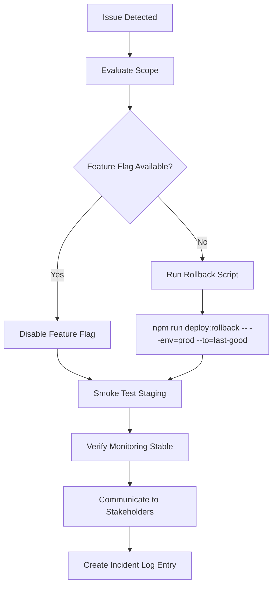

# Operational Runbooks

## Incident Response (P0/P1)

```mermaid
flowchart TD
    A[Detect Alert] --> B{Triage Severity}
    B -->|P0/P1| C[Assign Incident Commander]
    C --> D[Create Incident Channel (#incidents)]
    D --> E[Notify Stakeholders (Email/SMS)]
    E --> F[Mitigate (Rollback / Feature Flag / Hotfix)]
    F --> G[Monitor Metrics & Logs]
    G --> H{Resolved?}
    H -->|No| F
    H -->|Yes| I[Document Timeline]
    I --> J[Postmortem Draft < 12h]
    J --> K[Postmortem Review < 24h]
```

**Command Examples**
- `npm run deploy:rollback -- --target=production --to=previous`
- `firebase functions:log --only=playExport`
- `npx sentry-cli releases info <release>`

### On-Call Checklist
- [ ] Confirm alert source (Sentry/Datadog/PagerDuty).
- [ ] Validate severity and customer impact.
- [ ] Assign roles (IC, communications, scribe).
- [ ] Initiate mitigation (rollback, feature flag toggle).
- [ ] Update status every 15 minutes until resolution.

## Rollback Runbook



**Validation Commands**
- `npm run smoke:staging`
- `npm run e2e:ci -- --env=staging --spec=critical`
- `curl https://status.coachcore.ai/health`

## Escalation Matrix
| Role | Responsibility | Contact |
| --- | --- | --- |
| Incident Commander (IC) | Leads mitigation, decision making | On-call rotation (`@eng-oncall` Slack) |
| Product Manager | Customer comms, status updates | `pm@coachcore.ai` |
| CTO | Executive escalation, external comms approval | `cto@coachcore.ai` |
| Security Lead | Compliance liaison, breach assessment | `security@coachcore.ai` |
| Support Lead | Customer support ticket management | `support@coachcore.ai` |

_Assumption:_ PagerDuty configured for alert routing to `@eng-oncall`.
